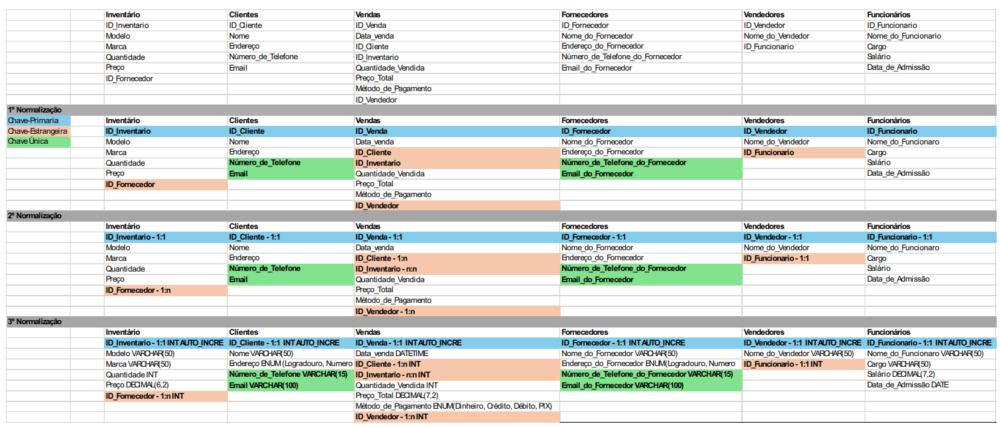

# Estudo de caso da BikeShop
## Desenvolvimento das modelagens do estudo de casa
### O estudo de caso:
#### BikeShop
Visão Geral:

A BikeShop é uma empresa especializada na venda de bicicletas e acessórios relacionados. 
Localizada em uma área urbana movimentada de Uberlândia, Minas Gerais, a empresa tem 
como objetivo oferecer uma variedade de bicicletas de alta qualidade para ciclistas de todos os 
níveis, desde iniciantes até ciclistas experientes e entusiastas.

Desafio:

A BikeShop está crescendo rapidamente e enfrenta desafios no gerenciamento eficiente de seu 
inventário, clientes e vendas. Atualmente, eles estão registrando essas informações 
manualmente ou usando planilhas eletrônicas, o que se tornou ineficiente e propenso a erros. 
Eles reconhecem a necessidade de um sistema de banco de dados centralizado que possa 
armazenar e gerenciar essas informações de forma mais eficaz.

Objetivos do Sistema de Banco de Dados:

Gerenciar o inventário de bicicletas e acessórios, incluindo detalhes como modelo, marca, 
quantidade em estoque, preço de venda e fornecedor.
Manter um registro centralizado de clientes, incluindo informações como nome, endereço, 
número de telefone, endereço de e-mail e histórico de compras.
Registrar e acompanhar as vendas de bicicletas e acessórios, incluindo detalhes como data da 
venda, produtos vendidos, preço de venda, método de pagamento e vendedor responsável.

Requisitos Funcionais do Sistema de Banco de Dados:

Capacidade de adicionar, atualizar e excluir itens do inventário, bem como verificar a 
disponibilidade de produtos em tempo real.
Capacidade de adicionar novos clientes, atualizar informações existentes e manter um histórico 
de suas compras anteriores.
Funcionalidade para registrar novas vendas, incluindo a associação dos produtos vendidos aos 
clientes correspondentes e a geração de recibos.
Recursos de segurança para proteger os dados do cliente e do inventário contra acesso não 
autorizado.
Capacidade de gerar relatórios de vendas, análises de estoque e dados do cliente para ajudar 
na tomada de decisões comerciais.

Abordagem Proposta:

A BikeShop planeja desenvolver um sistema de banco de dados personalizado usando 
tecnologias modernas de banco de dados, como MySQL ou PostgreSQL. Eles planejam 
colaborar com desenvolvedores de software especializados para projetar e implementar o 
sistema de acordo com seus requisitos específicos. O sistema será acessado por funcionários 
autorizados por meio de uma interface de usuário intuitiva, onde poderão realizar todas as 
operações necessárias de forma eficiente.

Benefícios Esperados:

Melhoria na eficiência operacional, permitindo que a BikeShop gerencie seu inventário, clientes 
e vendas de forma mais rápida e precisa.
Maior satisfação do cliente, oferecendo um serviço mais personalizado e mantendo um 
histórico detalhado das interações anteriores.
Melhoria na tomada de decisões comerciais com base em relatórios e análises de dados 
precisos e atualizados.
Com um sistema de banco de dados eficiente e bem projetado, a BikeShop está confiante de 
que poderá atender às demandas de seus clientes de maneira mais eficaz e continuar 
prosperando no mercado de bicicletas.

Modelo lógico para o estudo de caso
Tabelas:

Inventário:

ID_Inventario (Chave Primária)  
Modelo  
Marca  
Quantidade  
Preço  
ID_Fornecedor (Chave Estrangeira referenciando a tabela de Fornecedores)

Clientes:

ID_Cliente (Chave Primária)  
Nome  
Endereço  
Número_de_Telefone  
Email

Vendas:

ID_Venda (Chave Primária)  
Data  
ID_Cliente (Chave Estrangeira referenciando a tabela de Clientes)  
ID_Inventario (Chave Estrangeira referenciando a tabela de Inventário)  
Quantidade_Vendida  
Preço_Total  
Método_de_Pagamento  
ID_Vendedor (Chave Estrangeira referenciando a tabela de Vendedores)

Fornecedores:

ID_Fornecedor (Chave Primária)  
Nome_do_Fornecedor  
Endereço_do_Fornecedor  
Número_de_Telefone_do_Fornecedor  
Email_do_Fornecedor  

Vendedores:

ID_Vendedor (Chave Primária)  
Nome_do_Vendedor  
ID_Funcionario (Chave Estrangeira referenciando a tabela de Funcionários)

Funcionários:

ID_Funcionario (Chave Primária)  
Nome_do_Funcionario  
Cargo  
Salário  
Data_de_Admissão  

Relacionamentos:

Um fornecedor pode fornecer múltiplos itens de inventário, mas cada item de inventário é 
fornecido por apenas um fornecedor. (Relacionamento um para muitos entre Fornecedores e 
Inventário)
Um cliente pode fazer várias compras, mas cada compra é feita por apenas um cliente. 
(Relacionamento um para muitos entre Clientes e Vendas)
Cada venda inclui vários itens de inventário, e cada item de inventário pode estar presente em 
várias vendas. (Relacionamento muitos para muitos entre Vendas e Inventário)
Um vendedor pode fazer várias vendas, mas cada venda é realizada por apenas um vendedor. 
(Relacionamento um para muitos entre Vendedores e Vendas)
Cada vendedor é associado a apenas um funcionário. (Relacionamento um para um entre 
Funcionários e Vendedores)
Este modelo lógico de banco de dados reflete as entidades principais e seus relacionamentos 
no contexto da BikeShop, permitindo a organização eficiente dos dados e a realização de 
operações de negócios necessárias

#### Entidades levantadas

Inventário;  
Clientes;  
Vendas;  
Fornecedores;  
Vendedores;  
Funcionários;

#### Esquema de tabelas para o banco de dados


#### Modelo Físico: Código que gera o banco de dados
```sql
-- Comando para criar um novo banco de dados.
CREATE DATABASE bikeshop;
-- comando para selecionar o banco de dados criado.
USE bikeshop;

CREATE TABLE inventario(
id_inventario int auto_increment primary key,
modelo varchar(50) not null,
marca varchar(50) not null,
quantidade_inventario int not null,
preco decimal(6,2) not null,
id_fornecedor int not null
);

CREATE TABLE cliente(
id_cliente int auto_increment primary key,
nome varchar(50) not null,
endereco enum("Logradouro","Numero","Complemento","Bairro","CEP","Cidade","Estado"),
numero_de_telefone varchar(15) not null unique,
email varchar(100) not null unique
);

CREATE TABLE vendas(
id_venda int auto_increment primary key,
data_venda datetime default current_timestamp(),
id_cliente int not null,
id_inventario int not null,
quantidade_vendida int not null,
preco_total decimal(7,2) not null,
metodo_de_pagamento enum ("Dinheiro","Crédito","Débito","PIX"),
id_vendedor int not null
);

CREATE TABLE fornecedores(
id_fornecedor int auto_increment primary key,
nome_do_fornecedor varchar(50) not null,
endereco_do_fornecedor enum("Logradouro","Numero","Complemento","Bairro","CEP","Cidade","Estado"),
numero_de_telefone_do_fornecedor varchar(15) not null,
email_do_fornecedor varchar(100) not null
);

CREATE TABLE vendedores(
id_vendedor int auto_increment primary key,
nome_do_vendedor varchar(50) not null,
id_funcionario int not null
);

CREATE TABLE funcionarios(
id_funcionario int auto_increment primary key,
nome_do_funcionario varchar(50) not null,
cargo varchar(50) not null,
salario decimal(7,2) not null,
data_de_admissao date not null
);

CREATE TABLE detalhevendas(
id_detalhe_venda int auto_increment primary key,
id_inventario int not null,
id_venda int not null,
quantidade int not null,
subtotal decimal(7,2) not null
);

-- Alterar a tabela funcionário para adicionar uma chave
-- estrangeira e um relacionamento com a tabela de usuario

-- Inventário

ALTER TABLE inventario
ADD CONSTRAINT `fk.inventario_pk.fornecedor`
FOREIGN KEY inventario(`id_fornecedor`)
REFERENCES fornecedores(`id_fornecedor`);

-- Vendas

ALTER TABLE vendas
ADD CONSTRAINT `fk.vendas_pk.cliente`
FOREIGN KEY vendas(`id_cliente`)
REFERENCES cliente(`id_cliente`);

ALTER TABLE vendas
ADD CONSTRAINT `fk.vendas_pk.inventario`
FOREIGN KEY vendas(`id_inventario`)
REFERENCES inventario(`id_inventario`);

ALTER TABLE vendas
ADD CONSTRAINT `fk.vendas_pk.vendedor`
FOREIGN KEY vendas(`id_vendedor`)
REFERENCES vendedores(`id_vendedor`);

-- Vendedores

ALTER TABLE vendedores
ADD CONSTRAINT `fk.vendedor_pk.funcionario`
FOREIGN KEY vendedores(`id_funcionario`)
REFERENCES funcionarios(`id_funcionario`);

-- Detalhe e Vendas

ALTER TABLE detalhevendas
ADD CONSTRAINT `fk.dtvenda_pk.inventario`
FOREIGN KEY detalhevendas(`id_inventario`)
REFERENCES inventario(`id_inventario`);

ALTER TABLE detalhevendas
ADD CONSTRAINT `fk.dtvenda_pk.vendas`
FOREIGN KEY detalhevendas(`id_venda`)
REFERENCES vendas(`id_venda`);


-- comando que apaga o banco de dados.
-- drop database bikeshop;
```

#### Modelo Relacional do banco de dados

